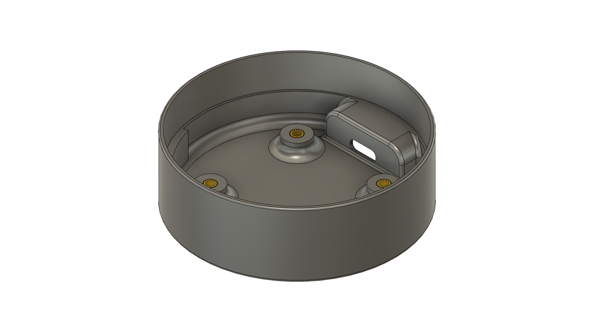

# esp32-homekit-led-strip
Native Apple HomeKit via an ESP32 for the IKEA SOLVINDEN lamp

Software is based on the [HomeSpan](https://github.com/HomeSpan/HomeSpan) library. Supports RGB or RGBW Neopixel LEDs.

_As usual, don't expect any warranties. I am just a hobbyist, not a professional. It works for me, but you take your own risk using it. I am not liable for any damage to your devices._

## Hardware

 

Custom PCB is designed for the project as well as a replacement base for the lamp. The base has holes for M3 threaded inserts.

 

From the original lamp, you only need the top part, which is good for diffusion. Be careful not to scratch it, as it sits pretty tight because the device is sealed.


## HomeKit functions

The device has two modes, which can be switched via the Eve app:
* Manual Control (manually set one single color)
* Rainbow (the device is changing colors)

*As they are custom characteristics, they are not visible in the Home app*

Characteristics values are saved to NVS, so they will be restored if the device loses power. 

## Software

Here you can see, which pins are used and pre-defined in the firmware:
```c++
 *                ESP-WROOM-32 Utilized pins
 *              ╔═════════════════════════════╗
 *              ║┌─┬─┐  ┌──┐  ┌─┐             ║
 *              ║│ | └──┘  └──┘ |             ║
 *              ║│ |            |             ║
 *              ╠═════════════════════════════╣
 *          +++ ║GND                       GND║ +++
 *          +++ ║3.3V                     IO23║ USED_FOR_NOTHING
 *              ║                         IO22║
 *              ║IO36                      IO1║ TX
 *              ║IO39                      IO3║ RX
 *              ║IO34                     IO21║
 *              ║IO35                         ║ NC
 *      RED_LED ║IO32                     IO19║
 *              ║IO33                     IO18║ 
 *              ║IO25                      IO5║
 *              ║IO26                     IO17║ NEOPIXEL
 *              ║IO27                     IO16║
 *              ║IO14                      IO4║
 *              ║IO12                      IO0║ +++, BUTTON
 *              ╚═════════════════════════════╝
```

The firmware can be built and flashed using the Arduino IDE.

For this, you will need to add ESP32 support to it.

Furthermore, you will also need to install the following libraries using the Library Manager:

* HomeSpan

And some libraries manually:

1. Go to this GitHub repo and download it as a ZIP - [ElegantOTA](https://github.com/ayushsharma82/ElegantOTA)
2. In Arduino IDE select "Sketch" -> "Include Library" and "Add .ZIP Library..." and select downloaded ZIP
3. Download and open this repository in Arduino IDE (or VSCode with Arduino extension)
4. Set the upload speed to 115200
5. Build, flash, and you're done

Instead of Arduino IDE OTA, the webserver update was implemented. You can flash binary at `http://[DEVICE IP]/update`.
There is a reboot link. Opening `http://[DEVICE IP]/reboot` will force the device to reboot. 

The device can also be controlled by the FLASH button on the board. More on [HomeSpan docs](https://github.com/HomeSpan/HomeSpan/blob/master/docs/UserGuide.md)

## Connect to HomeKit

1. Plug your LED Controller to power.
2. Press the FLASH button until the LED starts blinking rapidly and release it. Now it is in the configuration mode (More on [HomeSpan docs](https://github.com/HomeSpan/HomeSpan/blob/master/docs/UserGuide.md)). Press it two more times until the LED starts blinking 3 times in a row. This means mode 3 is chosen. Hold the button for 3-4 seconds once again and the WiFi AP will be started.
3. Go to WiFi settings on your iPhone/iPad and connect to the "HomeSpan-Setup" WiFi network.
4. You will choose your WiFi network and set the setup code for the accessory. 
5. Go to your Home app and select "Add Accessory"
6. Select "More Options" and you should see your LED Controller there.

## Todo

- [ ] Add physical button to control the device
- [ ] Add level shifter to the PCB for 5V on the data line for RGBW leds  

## References and sources

- @HomeSpan for ESP32 HomeKit firmware [GitHub link](https://github.com/HomeSpan/HomeSpan)
